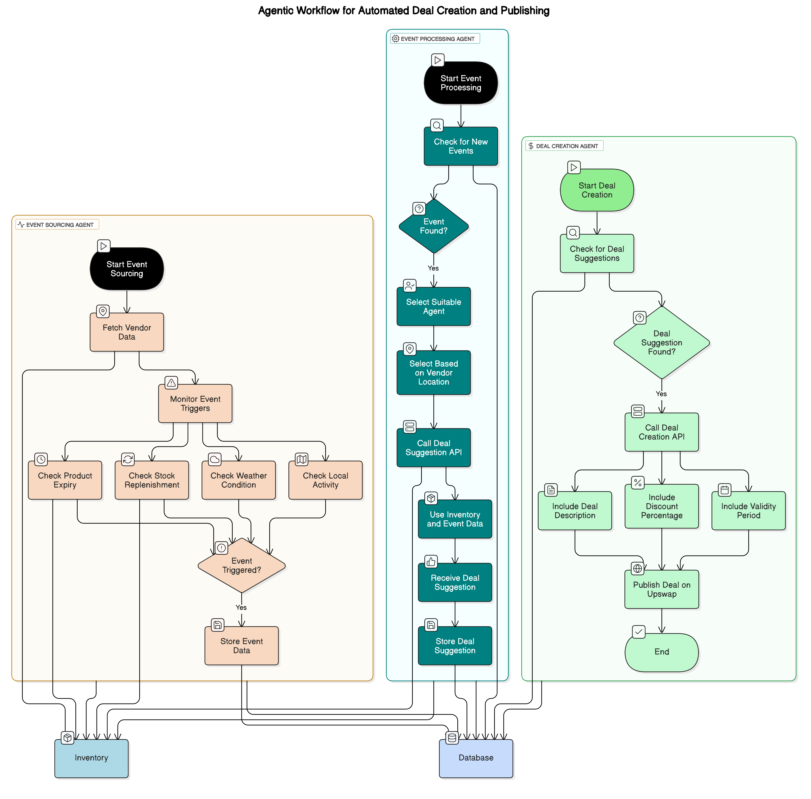

# Deals Agents Architecture

This diagram illustrates the agentic workflow for automated deal creation and publishing. The architecture is composed of three main agents, all interconnected through a central database, with the first two agents also linked to the inventory system:

1. **Event Sourcing Agent**: Responsible for fetching vendor location data and monitoring various event triggers such as weather conditions, local activities, product expiry, and stock replenishment. Since this agent is connected to the vendor inventory, it can detect relevant events and store event data in the database.

2. **Event Processing Agent**: Periodically checks the database for new events. Upon finding an event, it selects a suitable agent based on vendor location and other criteria, then calls an API to generate deal suggestions using inventory items and event data. The resulting deal suggestions are stored back in the database.

3. **Deal Creation Agent**: Monitors the database for available deal suggestions. When a suggestion is found, it calls an API to create the deal and publishes it on the Upswap platform, including details such as the deal description, discount percentage, and validity period.

This agentic workflow ensures that deals are created and published automatically based on real-time events and inventory data, streamlining the process from event detection to deal publication.
